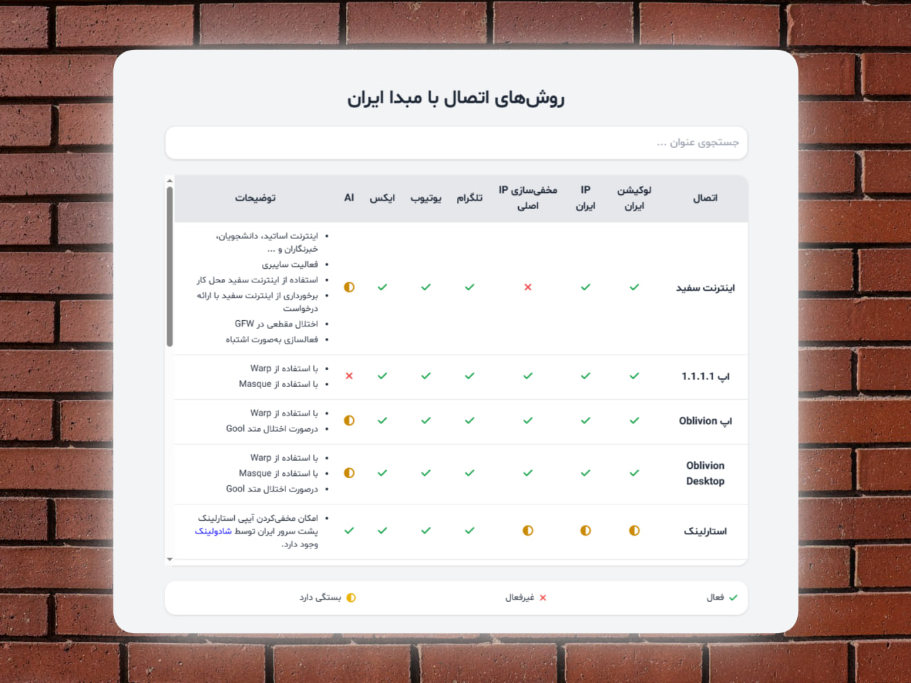

# 🇬🇧 Iran-Based Connection Methods

**Iran-Based** is a curated collection of methods, services, and network paths that provide connectivity from Iran or using an Iran-based IP. This repository is **not a software tool**, but a reference guide and knowledge base for Iran-based networking.

It also includes two wikis covering:

- **Warp vs Traditional VPN** – Insights into Warp performance compared to conventional VPN solutions.
- **Serverless Risks** – Overview of potential risks and security considerations.

Explore the interactive guide online:  
[https://ircfspace.github.io/iran-based](https://ircfspace.github.io/iran-based/)

Wikis:

- [Warp vs Traditional VPN](warp-vs-traditional-vpn.md)
- [Serverless Overview](serverless-risk-overview.md)

---

# 🇮🇷 روش‌های اتصال ایران‌محور

ریپازیتوری **Iran-Based** در رابطه با مجموعه‌ای از روش‌ها، سرویس‌ها و مسیرهای شبکه است که اتصال از ایران یا با IP ایران را امکان‌پذیر می‌کند. این ریپو ابزار نرم‌افزاری نیست، بلکه یک راهنمای مرجع و دانشنامه برای شبکه‌های ایران‌محور است.

دو ویکی هم شامل می‌شود:

- **وارپ در برابر VPN سنتی** – مقایسه عملکرد وارپ با VPNهای معمولی.
- **ریسک‌های سرورلس** – مرور ریسک‌ها و نکات امنیتی.

راهنمای تعاملی آنلاین را ببینید:  
[https://ircfspace.github.io/iran-based](https://ircfspace.github.io/iran-based/)

ویکی‌ها:

- [وارپ در برابر VPN سنتی](warp-vs-traditional-vpn.md)
- [بررسی ریسک‌های سرورلس](serverless-risk-overview.md)

