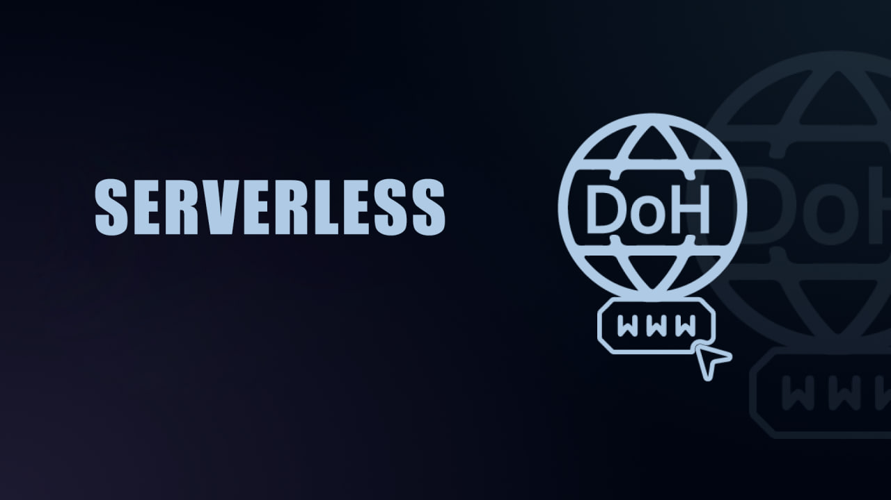

# Serverless | سرورلس

# کانفیگ‌های سرورلس برای اتصال به ایکس ناامن هستن؟

وقتی با IP واقعی خودمون از طریق کانفیگ‌های سرورلس (پروفایل‌های مبتنی‌بر DoH که ترافیک رو به‌صورت مستقیم و بدون تونل سمت سرویس مقصد می‌فرستن) به سرویسی مثل ایکس وصل میشیم، آی‌پی و موقعیت جغرافیایی ما برای سرویس مقصد قابل مشاهده هست، اما محتوای ارتباط به‌خاطر رمزنگاری TLS/HTTPS برای اشخاص ثالث قابل شنود نیست.

کانفیگ‌های سرورلس که برای بایپس فیلترینگ طراحی شدن و از اونها به‌عنوان کانفیگ اضطراری یاد می‌کنیم، یکی از راه‌های متداولی هستن که برای دورزدن فیلترینگ یوتیوب و ایکس در محدودیت‌های مختلف مورد استفاده قرار می‌گیرن.
در هنگام استفاده از این کانفیگ‌ها، لوکیشن و آی‌پی کاربر (برخلاف استفاده از VPNهای سنتی) تغییر نکرده، و در اکثر کانفیگ‌های اینچنینی SNI رمزنگاری نمیشه و ISP دقیقاً می‌فهمه که به x.com یا youtube.com وصل شدی؛ اما هویت کاربر، محتوای فعالیت‌ها، پیام‌ها و اطلاعات حساب کاربری اون صرفاً در اختیار خود کاربر و سرویس X باقی می‌مونه و برای ISP یا نهادهای ایران قابل مشاهده نیست.

سرویس‌دهنده اینترنت یا نهادهای ایران، با وجود اطلاع از IP واقعی کاربر در هنگام اتصال سرورلس، زمان اتصال و الگوی کلی ترافیک، نمی‌تونن به‌صورت مستقیم و قابل‌اتکا یک کاربر رو به یک پروفایل مشخص در ایکس متصل کنن؛ چون داده‌های حساس و هویت‌زا کاملاً تحت TLS رمزگذاری شده و از دید ISP پنهان می‌مونن.

نکته قابل توجه تحلیل الگوی ترافیک هست، که می‌تونه "حدس احتمالی" ارائه بده، اما راه قطعی برای تطبیق یک اتصال سرورلس با یک حساب کاربری X وجود نداره و هرچی استفاده از کانفیگ‌های سرورلس بیشتر بشه، ردفلگ کمتر و اتکای DPI به حدس مبتنی بر الگوی ترافیک دشوارتر میشه.

### جمع‌بندی

1. کانفیگ‌های سرورلس ابزار ناامنی نیستن و در حال حاضر یکی از بهترین روش‌های "اضطراری" برای دسترسی به ایکس و یوتیوب در زمان محدودیت‌های شدید محسوب میشن.
2. این پروفایل‌ها (با توجه به مخفی نکردن آی‌پی و در اکثر موارد قابل مشاهده بودن اس‌ان‌آی) Anonymity کامل ارائه نمیدن و همیشه توصیه اینه برای امنیت بالاتر، اولویتتون استفاده از VPNهای معتبر باشه.
3. انواع روش‌های اتصال که میتونن ترافیک رو به مبدا ایران هدایت کنن، به‌صورت تفکیک‌شده در دانشنامهٔ [iran-based](https://ircfspace.github.io/iran-based/) فهرست شدن.

نه به فیلترینگ، نه به اینترنت طبقاتی!
 
© IRCF

