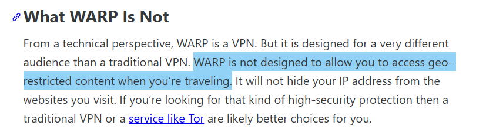
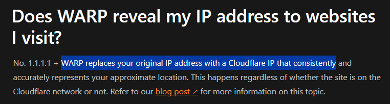

# WARP | وارپ

## چه چیزی هست؛ چه چیزی نیست!

طبق اعلام کلودفلر، وارپ اگرچه از نظر فنی یک VPN است و داده‌های شما را امن و از شنود محافظت می‌کند، اما یک VPN سنتی نیست و موقعیت جغرافیایی شما را از وب‌سایت‌هایی که بازدید می‌کنید پنهان نمی‌کند. [[+]](https://blog.cloudflare.com/announcing-warp-plus/?utm_source=chatgpt.com/#what-warp-is-not)

## استفاده از وارپ ریسک دارد؟

بر اساس مستندات کلودفلر، اگرچه در استفاده از Warp یا Masque موقعیت تقریبی شما یعنی کشوری که از آن به اینترنت متصل شده‌اید مشخص خواهد بود، اما آدرس IP اصلی شما با یک IP از شبکه کلودفلر جایگزین می‌شود و اشخاص ثالث از طریق IP قادر به شناسایی هویت شما نخواهند بود. [[+]](https://developers.cloudflare.com/warp-client/known-issues-and-faq/?utm_source=chatgpt.com#does-warp-reveal-my-ip-address-to-websites-i-visit)

بسیاری از VPNها به کاربران خود اجازه می‌دهند کشور خروجی را پس‌از اتصال انتخاب کنند، تا لوکیشنی متفاوت نمایش داده شود؛ اما وارپ یا مسک اینگونه عمل نمی‌کنند. بنابراین اگر از ایران توسط وارپ یا مسک متصل شده باشید، لوکیشن شما همان ایران خواهد بود، اما IP شما به آیپی کلودفلر تغییر می‌کند.

پروتکل اتصال و رمزنگاری WARP بر امنیت اتصال متمرکز است، نه ناشناسی IP. یعنی وارپ برای محافظت در برابر شنود شبکه و ISP طراحی شده، نه برای پنهان کردن کشور اتصال کاربر.

## ایکس ممکن است وارپ را به‌عنوان VPN تشخیص ندهد

- وارپ از شبکه Anycast کلودفلر استفاده می‌کند که IP خروجی کاربر، IP رسمی کلودفلر است؛ نه یک سرور خصوصی یا residential VPN؛ که این IPها در دیتابیس‌های GeoIP به‌عنوان CDN / Enterprise egress ثبت شده‌اند، نه IP ناشناس یا پراکسی. بنابراین سیستم تشخیص VPN یا anonymous proxy در X احتمالا این IPها را “مشکوک” نمی‌داند.
- ایکس سرویس‌هایی مانند Tor، open proxies، و VPSهای کوچک را احتمالا به عنوان VPN/anonymous network تشخیص می‌دهد. این تشخیص بر اساس دیتابیس‌ها و reputation system مثل Tor exit node list، IP ranges مشخص شده در دیتابیس‌های open proxy و IPهای دیتاسنترهای ناشناس با reputation پایین انجام می‌شود. در نتیجه آی‌پی‌های کلودفلر به نظر می‌رسد در این دیتابیس‌ها قرار نداشته و چون reputation بالایی دارند، به‌عنوان VPN دسته‌بندی نگردند.
- وارپ داده‌ها را از دستگاه تا شبکه کلودفلر رمزنگاری می‌کند و هدف آن محافظت در برابر شنود ISP و شبکه‌های عمومی است. بنابراین ترافیک وارپ نباید در سرویس‌هایی نظیر X به‌عنوان یک ترافیک مشکوک تلقی و به اضافه‌شدن سپر VPN detection منجر گردد.

## جمع‌بندی

تا این لحظه هیچ مدرک علنی یا مستندی وجود ندارد که ثابت کند وارپ در سرویس ایکس به‌عنوان VPN/Proxy طبقه‌بندی گردیده. بنابراین تا زمانی که خود X سندی منتشر نکند، نمی‌توان با قطعیت گفت وارپ یا مسک توسط X به‌عنوان VPN شناسایی می‌شوند یا خیر.

